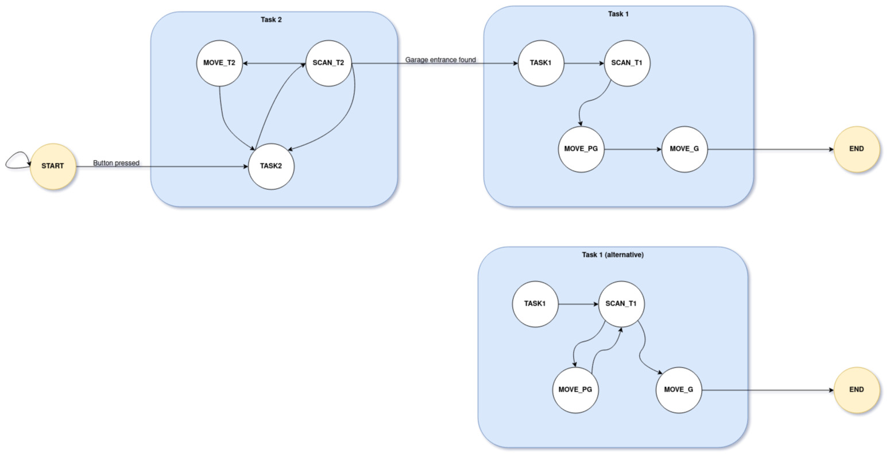

## Setup

### Connect to turtlebot in two terminals
``` bash
ssh -X -L 8888:localhost:8888 username@192.168.210.xx
```

### To install jupyter notebook:
```bash
pip3 install notebook
```

### Run this in your *first* terminal
``` bash
mount /local
singularity shell /local/robolab_noetic_2022-03-31.simg
source /opt/ros/lar/setup.bash
roslaunch robolab_turtlebot bringup_realsense_D435.launch # for turtle08-13
```

### Run this in your *second* terminal
``` bash
singularity shell /local/robolab_noetic_2022-03-31.simg
source /opt/ros/lar/setup.bash
cd && mkdir lar && cd lar
git clone https://github.com/basta/LAR.git --branch final_task2
~/.local/bin/jupyter-notebook --NotebookApp.token='' --NotebookApp.password=''
```

## Finite-State-Machine architecture for Task 2
